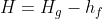
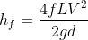
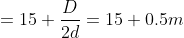
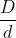
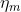
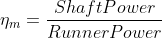
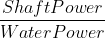

### INTRODUCTION 

Pelton wheel is impulse type water turbine which extracts energy from impulse of moving water when the water strikes the pelton cup at very high speed, it induces an impulsive force which makes the turbine rotate. In short the pelton wheel transforms the kinetic energy of water jet into rotational energy.

  

Cross-section of Hydraulic Ram
 

Source: (<a href="https://aybu.edu.tr/muhendislik/makina/contents/files/MCE%20403-Pelton%20Turbine%20Experiment%20Sheet.pdf">https://aybu.edu.tr/muhendislik/makina/contents/files/MCE%20403-Pelton%20Turbine%20Experiment%20Sheet.pdf</a>)

 

The spoon shaped buckets are mounted on the circumferential rim of drive wheel called runner. As the high-speed jet of water impinges upon the pelton cups, the direction of the water velocity is changed to follow the contour of the bucket. The impulse energy of water exerts torque on the bucket and makes the wheel to spin, and finally the water takes U-turn and exits at the sides of pelton cup with low velocity.

Control of the turbine is maintained by hydraulically operated needle nozzles in each jet. In addition, a jet deflector is provided for emergency shutdown. The deflector diverts the water jet from the buckets to the wall of the pit liner. This feature provides surge protection for the penstock without the need for a pressure relief valve because load can be rapidly removed from the generator without changing the flow rate. Control of the turbine may also be accomplished by the deflector alone. On these units the needle nozzle is manually operated and the deflector diverts a portion of the jet for lower loads. This method is less efficient and normally used for speed regulation of the turbine under constant load.

<strong>The main parts of Pelton Turbine are</strong>:

<ol style="text-indent:25px;text-align:justify;list-style-position: inside;">
<li><strong>Nozzle and Flow regulation arrangement</strong>: The amount of water flowing out from the nozzle is regulated by providing a spear in the nozzle. The spear is a conical shaped needle which is operated by manually or automatically in an axial direction depending upon the size of the unit.

Nozzle and Flow Regulation Arrangement
 

Source: (<a href="https://theconstructor.org/practical-guide/pelton-turbine-parts-working-design-aspects/2894/">https://theconstructor.org/practical-guide/pelton-turbine-parts-working-design-aspects/2894/</a>) 

</li>

<li><strong>Runner and Buckets</strong>: Runner consists of a circular disc on the periphery of which number of buckets are attached with equal spacing. The pelton buckets are in cup or bowl shape and each bucket is divided into symmetrical parts by a wall called splitter. The splitter divides the jet of water into two equal parts. The buckets are designed in such a way that the water jet gets deflected through 160&deg; or 170&deg;. The buckets are made of bronze, cast iron or stainless steel depending upon the head at the inlet of the turbine.</li>

<li><strong>Casing</strong>: The function of water is to prevent the splashing of water and to guide the discharged water to tail race. The casing of Pelton Wheel does not perform any Hydraulic function.</li>

<li><strong>Breaking Jet</strong>: When the nozzle is closed completely by moving the spear in forward direction, the amount of water striking the bucket reduces to zero. But due inertia, the runner goes on revolving for some more time. To stop the runner in a short time, a small nozzle is provided which directs the water from the back of the buckets. This water jet is known as breaking jet.</li>
</ol> 

<strong>Important terms</strong>:

Potential Energy of Turbine
 

Source: (<a href="https://ecoandsustainable.com/2013/03/17/hydropower/">https://ecoandsustainable.com/2013/03/17/hydropower/</a>)

 

<strong>Headrace</strong>: A dam constructed across a river or a channel to store water. The reservoir is also known as Headrace.

<strong>Tailrace</strong>: It is the channel which conveys the water out from the turbine casing after hitting the pelton bucket.

<strong>Gross head ()</strong>: It is the vertical difference between headrace and tailrace.

<strong>Net head ()</strong>: It is the actual head available at the inlet of the turbine to work.

Where,

= total loss of head due to friction during the transit of water from headrace to tailrace and is given by,

Where,

 = coefficient of friction of penstock depending on the type of material of penstock

 = total length of penstock

 = mean flow velocity of water through the penstock

 = diameter of penstock and

 = acceleration due to gravity

<strong>Governing mechanism in Pelton Wheel</strong>:

A governing mechanism which controls position of the spear head meets the power demand requirement. With lowering power demand the spear head at water inlet nozzle is moved in. So that water flow rate get reduced. If power demand increases spear head is moved out this will increase the flow rate.

So, in pelton wheel, the power supply can be made to meet the power demand by controlling the water flow rate. So this governing mechanism in turn will balance the power supply and power demand and will make sure that the turbine will rotates at the constant speed. This speed is also conforms to power supply frequency. So this mechanism acts as speed governing mechanism in pelton wheel.

<strong>Number of buckets in pelton wheel</strong>:

Number of buckets in pelton wheel is one of the most important parameter in the design of pelton turbine. If the number of buckets are inadequate, then, this will result in loss of water jet. That is, when one of bucket comes in contact with water jet, the next bucket may not get engaged with water jet. This will result in loss of water jet for a short duration which later tends to sudden drop in efficiency.

Number of buckets 

Where,  = jet ratio = 

Since the water jet is always open to atmosphere, the pressure at inlet and outlet will be same as atmospheric pressure. However absolute velocity of fluid will have huge drop from inlet to exit of the bucket. This drop of kinetic energy is the maximum energy that the bucket can absorb.

So it is clear that, pelton turbine gains mechanical energy purely due to change in kinetic energy of jet, not due to pressure energy change. Which means, pelton turbine is a pure impulse machine.

<strong>Power extraction</strong>:

If the pelton wheel buckets are held stationary, then the power extraction is zero. If the pelton wheel buckets are rotating with the same speed of water jet, the jet won’t be able to hit the bucket. Hence in this case also the power extraction will be zero. Hence the power extraction is zero both at speed of bucket is zero and when bucket speed is same as jet speed.

<strong>Types of efficiencies</strong>:

Depending on the considerations of input and output, the efficiencies can be classified as

<ul style="text-indent:50px;text-align:justify;list-style-position: inside;">
<li>Hydraulic Efficiency</li>
<li>Mechanical Efficiency</li>
<li>Overall Efficiency</li>
</ul>

<strong>Hydraulic Efficiency()</strong>:

It is the ratio of the power developed by the runner of a turbine to the power supplied at the inlet of a turbine. Since the power supplied is hydraulic, and the probable loss is between the striking jet and vane it is rightly called hydraulic efficiency.

<strong>Mechanical Efficiency()</strong>:

It is the ratio of the power available at the shaft to the power developed by the runner of a turbine. This depends on the slips and other mechanical problems that will create a loss of energy between the runner in the annular area between the nozzle and spear, the amount of water reduces as the spear is pushed forward and vice – versa and shaft which is purely mechanical and hence mechanical efficiency.

<strong>Overall Efficiency()</strong>:

It is the ratio of the power available at the shaft to the power supplied at the inlet of a turbine. As this covers over all problems of losses in energy, it is known as overall efficiency. This depends on both the hydraulic losses and the slips and other mechanical problems that will create a loss of energy between the jet power supplied and the power generated at the shaft available for coupling of the generator.

